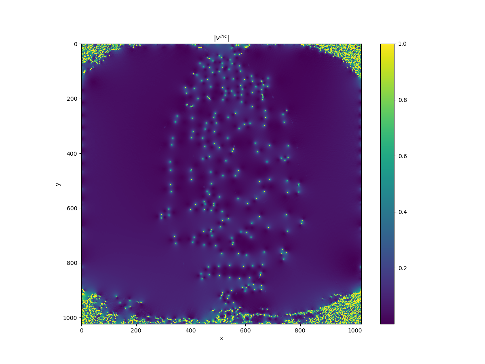
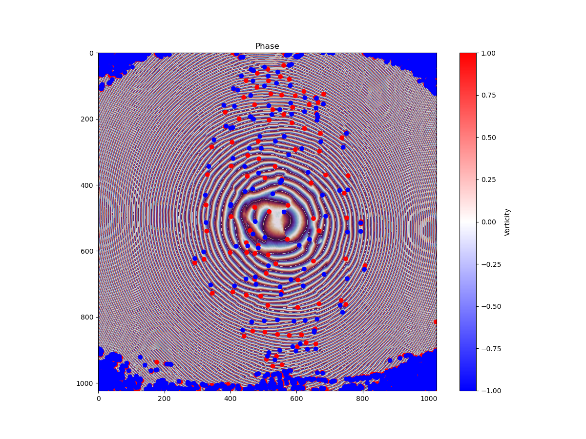
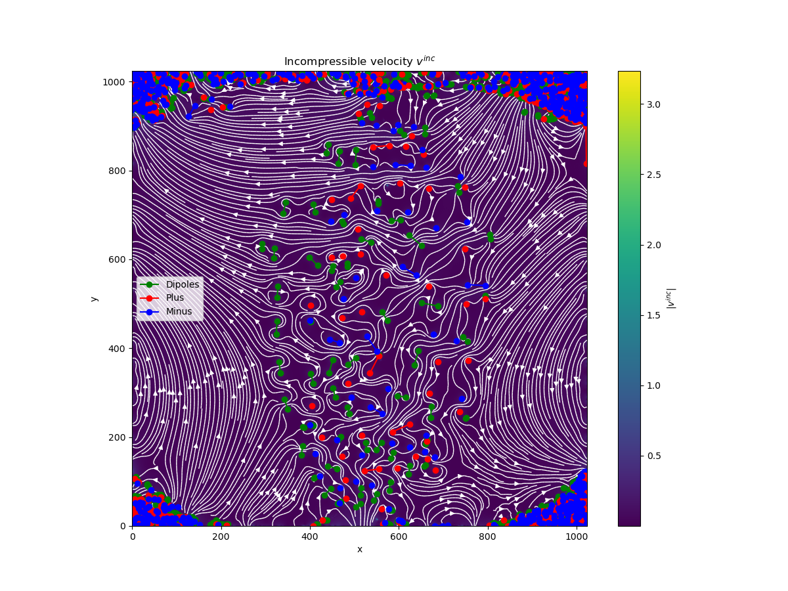

# PhaseUtils
*A selection of utilities to retrieve and process phase information of optical fields*

## Dependencies

- `numba`
- `cupy`
- `numpy`
- `skimage`
- `numbalsoda`
- `pyfftw`
- `pickle`
- `scipy`
- `matplotlib`
- `networkx`

### GPU computing

For optimal speed, this code uses your GPU (graphics card) for vortex detection. For this, you need specific libraries. For Nvidia cards, you need a [CUDA](https://developer.nvidia.com/cuda-toolkit) install. For AMD cards, you need a [ROCm](https://rocmdocs.amd.com/en/latest/) install. Of course, you need to update your graphics driver to take full advantage of these. In any case we use [CuPy](cupy.dev) for the Python interface to these libraries. The routines dependant on cupy have the `_cp` postfix in their names.

### PyFFTW

The CPU based implementation uses the speedy FFT library FFTW : [PyFFTW](https://pyfftw.readthedocs.io/en/latest/). To make the best out of your computer, this library is multithreaded. By default it will use all available threads. If this is not what you want, you can disable this by setting the variable `pyfftw.config.NUM_THREADS` to a number of your choosing.

## `contrast.py`

This code contains all the functions necessary to retrieve the phase from an off-axis interferogram as presented in [this preprint](https://arxiv.org/abs/2202.05764).
It leverages the computation capabilities of GPU's to achieve ms speed for phase recovery, which allows it to be used in real time.
It also includes fucntions (`delta_n`) to recover the non-linear index of some medium by measuring phase front deformation through Kerr effect.
Most of the functions can run on the CPU or the GPU: the GPU variant of each function is indicated by its `_cp` postfix.

The detailed tutorial of the process is explained in the [`demo_contrast`](examples/demo_contrast.ipynb) Jupyter notebook.

## `monitor_phase.py`

A set of live viewers for lab use:
- `monitor_fourier_fringes` will display a live window with the two Fourier quadrans to align the interferometer.
- `monitor_phase` will display a live window with the phase and intensity of the field.
- `monitor_fourier_space` will display a live window with the Fourier space of the field.
The last function is especially useful since transforming the field instead of imaging directly the Fourier space after a lens allows to get a much better dynamic range.

## `SLM.py`

A small utility to display a borderless window to control SLM and DMD's in display mode. 
The `phase_intensity` function allows to display a modulated grating allowing to control phase and intensity of a beam according to the technique presented in [this paper](https://opg.optica.org/abstract.cfm?URI=ao-42-11-2003).

## `velocity.py`

A set of utilities to study 2D turbulence in fluids of light. The main code is `velocity.py` which contains all utilities to analyze the phase of the fluid in order to retrieve the velocity fields, detect vortices and cluster them in order to extract useful statistical properties. The code can be easily adapted to a wider variety of physical situations since it only relies on the information given by a 2D velocity field.

### How does it work ?

The code contains three main routines : 
- `helmholtz_decomp` to extract both the compressible and incompressible velocities of the flow using the Helmholtz decomposition into rotationnal and irrotationnal parts
- `vortex_detection` to detect vortices
- `cluster_vortices` to cluster vortices into dipoles and clusters of same sign vortices.

A sample phase front is in the archive `v500_1_phase.zip`. It extracts to a `.txt` file.

### Velocity fields 

In the context of fluids of light, one can define the speed of the fluid as the gradient of its phase : if $E = E_0 e^{i\phi}$ then the speed of the fluid in the transverse plane is simply $v =k_0 \nabla_\perp \phi$ (with $k_0$ the wavenumber and $\nabla_\perp = \partial_x+\partial_y$).\
The function `velocity` computes exactly this starting from a phase distribution $\phi$. Note that it also unwraps the phase to avoid potentially problematic phase jumps.\
From this, the function `helmholtz_decomp` retrieves the compressible and incompressible flows using the Helmholtz decomposition. As the rotational is computed in the Fourier domain, this decomposition gains a lot of speed when carried out on a GPU thus if possible, we recommend its `_cp` variant.

### Vortex detection

Vortex detection is carried out by brute force calculation of the circulation of the phase gradient on a 4 pixel closed contour. If a pixel is in the position $i, j$, then $\sum_{i,i+1, j, j+1}\nabla\phi_{i,j}= m2\pi,~m\in\mathbf{Z}$ [as explained here](https://www.google.com/url?sa=t&rct=j&q=&esrc=s&source=web&cd=&cad=rja&uact=8&ved=2ahUKEwjB9qyC27D6AhWKZMAKHQNuD8gQFnoECBUQAQ&url=https%3A%2F%2Fopg.optica.org%2Fabstract.cfm%3Furi%3Doe-20-5-4988&usg=AOvVaw1tuvDn9DdnRWvQxqjd1SVL). Then again, this computation benefits greatly from the parallelism allowed on GPU architectures, thus we recommend using the `vortex_detection_cp` routine when possible.

### Vortex clustering

Once we have detected vortices, one interesting observable to compute is how they cluster. For this the rules followed are :
- A pair of vortices of opposite sign that are mutual nearest neighbors are considered as a dipole
- Any pair of same sign vortices that are closer to each other than either is to an opposite sign vortices are put in the same cluster 
(see [this paper](https://journals.aps.org/prl/abstract/10.1103/PhysRevLett.112.145301) for more details).

In order to solve this without expensive distance matrix calculations (which we did before), we represent the vortex coordinates in a Kd-Tree using the `spatial` module of `scipy`. Since we only care about nearest neighbors, this is orders of magnitude more efficient. \
We then filter mutual nearest neighbors using the creatively named function `mutual_nearest_neighbors`. From this, we generate the array of dipoles and same sign pairs using the `build_pairs` function. This constitutes the application of the first rule.\
Then, we switch to another representation for the vortices to facilitate clustering : we represent the vortices as an undirected graph. This is done through the `networkx` library. We instantiate the graph with the same sign pairs as nodes, with edges between each pair. We then add the remaining vortices as nodes.\
Then, using the `clustering` routine we apply the second rule by checking if each nearest neighbor of the vortices in the queue belong to a dipole or not. If not, we can link each member of the queue to its closest neighbor. After having applied this function, we thus have a graph that completely represents the vortices that are not a dipole pair.\
Finally, we only need to extract the connected components of this graph to retrieve the various clusters of vortices, which is a built-in feature of `networkx`'s `Graph` object. 

### The `main` function

An overview is presented within the `main` function (that runs if you call `python velocity.py`). There are also some benchmarks to allow you to chose the best performing implementations between GPU and CPU. A sample of real phase data is given `v500_1_phase.gz` : a 1024 by 1024 array that contains 2981 vortices. On this real data here are some typical times for a 8-core Intel Xeon / Nvidia GeForce RTX 3000 equipped laptop :
- `vortex_detection` 50 ms
- `vortex_detection_cp` 5 ms (1.7 ms on a RTX3090)
- `helmholtz_decomposition` 130 ms
- `helmholtz_decomposition_cp` 10 ms (4 ms on a RTX3090)
- `vortex_clustering` 2.7 ms

These speeds (especially on the GPU) allow for practical **real time tracking of vortices**. Furthermore the clustering algorithm shows a nice $O(N~log(N))$ tested complexity.

## Other references
[Modulated gratings](https://opg.optica.org/abstract.cfm?URI=ao-42-11-2003)
[Transit preprint](https://arxiv.org/abs/2202.05764)
[VortexDistributions.jl](https://github.com/AshtonSBradley/VortexDistributions.jl) A Julia based implementation of the authors of the excellent paper about clustering. Lacks the clustering routines on the main branch. 
